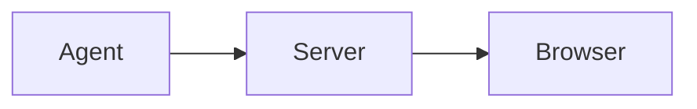

# Sample feature spec

This is a fixture used to dogfood the axi review surface.

## Goals

The system must be fast and reliable.

| Metric | Target |
| ------ | ------ |
| Load   | < 1s   |
| Errors | 0      |

## Flow

